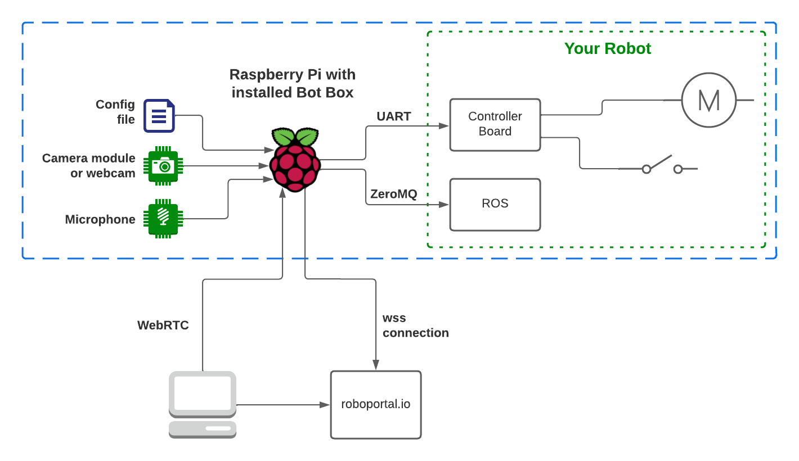

# Bot Box

Bot Box is a client application for https://roboportal.io.
It enables peer-to-peer controls, video and audio streaming between robots and web-based control panels. In other words, if you are building the robot and planning to add remote-control functionality and real-time video/audio streaming, it is worth considering using this service.

# Features

- real time video and bidirectional audio streaming
- keyboard and gamepad controls streaming with data channel
- telemetry streaming to the platform. Position on map and battery voltage are supported
- connect robot via UART or ZeroMQ

# How it works



# Installation guide

1. Prepare SD card with Raspberry Pi OS image. [How To guide for Raspberry Pi Imager.](https://www.youtube.com/watch?v=ntaXWS8Lk34) We don't need Desktop version for this application.
2. Enable camera, SSH (optional, but handy) and set up the WiFi with `raspi-config`. It also make sense to change the default password and set up the auto login. Default GPU memory allocation (128MB) might not be enough for real-time video converting / streaming, so it should be ~256MB. [ Documentation for raspi-config.](https://www.raspberrypi.org/documentation/configuration/raspi-config.md).
3. Install git and wget (staring from this step you'll need an internet connection)

```
sudo apt update
sudo apt install git wget libatomic-ops-dev pkg-config libvpx-dev libopus-dev libopusfile-dev libasound2-dev libsodium-dev libzmq3-dev libczmq-dev
```

4. Install golang

```
wget https://go.dev/dl/go1.19.4.linux-armv6l.tar.gz
sudo tar -C /usr/local -xzf go1.19.4.linux-armv6l.tar.gz
rm go1.19.4.linux-armv6l.tar.gz
```

5. And configure it:
   - Open .profile `nano ~/.profile`
   - And insert this:
   ```
   PATH=$PATH:/usr/local/go/bin
   GOPATH=$HOME/go
   ```
   - save your changes and exit nano: `Ctrl + O` and `Ctrl + X`
   - apply your changes: `source ~/.profile`
   - check the installation: `go version`
6. Clone this repository to your Raspberry:
   `git clone https://github.com/roboportal/bot_box.git`

7. Navigate to the repo: `cd ./bot_box`
8. And compile the BotBox: `CGO_LDFLAGS="-latomic" go build -tags=arm` for raspberry or `go build` for mac.
9. Create `.env` file for the configuration [following the instructions](#botbox-configuration).
10. Run the bot by executing: `./bot_box`

# BotBox configuration

All the configuration of Box Bot is done by setting up `.env` file. You can use `.env_example` as a staring point for your config.
The list of params:

- `srv_url` - the WSS endpoint of roboportal.io
- `public_key` and `secret_key` - the key pair obtained after the bot creation
- `stun_urls` - comma-separated list of STUN servers URLs
- `video_codec_bit_rate` - bit rate for video codec
- `frame_format` - camera image format
- `video_width` - camera image width
- `video_frame_rate` - camera frame rate
- `audio_input_enabled` - enable audio streaming to roboportal
- `audio_output_enabled` - enable audio streaming form roboportal
- `output_mode` - destination for control commands: `console` | `serial` | `ipc`
- `port_name` - name of the serial port to communicate with robot hardware
- `baud_rate` - serial port baud rate
- `bot_box_ipc_port` - BotBox ipc port
- `robot_ipc_port` - robot ipc port
- `robot_ipc_host` - robot ipc host name

# Supervisor setup

Let's setup supervisor. It will start Bot Box process after Raspberry Pi boot and handle restarts after possible application crashes.

1. Install the supervisor: `sudo apt-get install supervisor`
2. The next step is to setup `supervisorctl` for `pi` user: `sudo nano /etc/supervisor/supervisord.conf`
3. Under the section `[unix_http_server]` modify and create this:

```
chmod=0770
chown=root:pi
```

4. Create the config file for Bot Box: `sudo nano /etc/supervisor/conf.d/bot-box.conf`
5. Add there the following:

```
[program:bot-box]
command=/home/pi/bot_box/entrypoint.sh
directory=/home/pi/bot_box
autostart=true
autorestart=true
user=pi
killasgroup=true
stopasgroup=true
```

6. To start the bot box run `supervisorctl start bot-box`. There are some handy commands: `supervisorctl stop bot-box`, `supervisorctl restart bot-box`, `supervisorctl tail bot-box stdout`.

# Messages format

`bot_box` communicates with robot via JSON serialized messages.

## Robot controls formats

Typical control message has the format: `{"address": a, "controls": m}`.

### Address

In such message address 'a' is an integer number: 0 or 1. 0 is a default value, 1 is applicable to the second control in a 'Fight Mode'. When 'Fight Mode' is disabled address could be ignored by the robot hardware.

### Controls

Controls message 'm' contains a payload of commands for robot hardware to execute.

For example:

- Enable controls - `{"address":0,"controls":{"start":true}}` - this message will be sent to robot after 'Controls' are enabled in RoboPortal UI.

- Disable controls - `{"address":0,"controls":{"stop":true}}` - this message will be sent to robot after 'Controls' are disabled in UI or interrupted p2p connection.

- Control command - `{"address":0,"controls":{"l":0,"r":0,"f":100,"b":0}}` -
  such payload is defined by 'Controls Setup' in RoboPortal application by setting key-value pairs. The message above is used in 'Scout' robot example. It represents 'Move Forward' command.

## Telemetry

Robot could send it's location and battery data to be presented to user as widgets using following format:

```
{
  "id": 0,
  "lat": 49.2766275048836,
  "lng": -123.13133235249737,
  "headingAngle": 90,
  "battery": {
    "min": 18,
    "max": 25.2,
    "value": 24,
    "uom": "V",
    "charging": False
  }
}
```

`id` - id of the robot, check 'Controls' section

GPS:

`lat` - latitude
`lng` - longitude
`headingAngle` - magnetic compass angle

Battery (as `battery` object):

`min` - minimum possible value
`max` - maximum possible value
`value` - current value (charge, voltage)
`uom` - unit of measure for value (V, % etc)
`charging` - is charging or not

# Media devices troubleshooting 

- To enable Raspberry Pi Camera Module support on Raspbian Bullseye `Legacy Camera Mode` should be enabled with `raspi-config`.
- [How to use USB audio devices with Raspberry Pi.](https://www.raspberrypi-spy.co.uk/2019/06/using-a-usb-audio-device-with-the-raspberry-pi/)

# Video Tutorials

Visit the ROBOPORTAL YouTube [channel](https://www.youtube.com/channel/UC-CswhfCJ-i4M9BcoTOE9oA) for the tutorials.

# Contacts:

[Join our Discord channel](https://discord.gg/2MmWFapCrp) or reach out over email: info@roboportal.io
