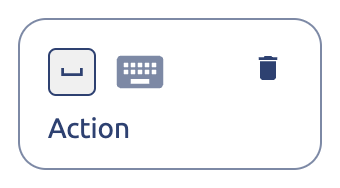
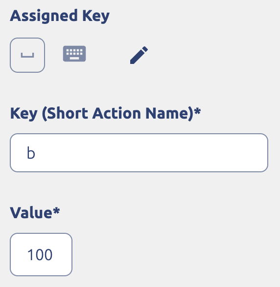
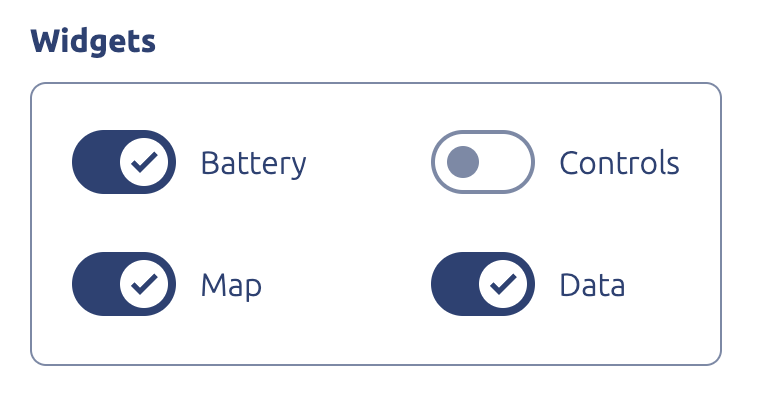
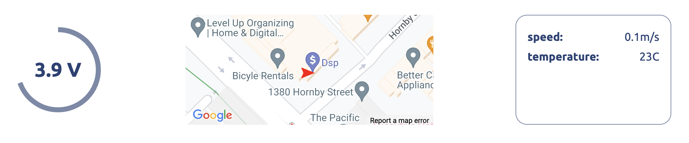

# Connecting arduino to Bot Box via serial port

1. [Arduino boilerplate](https://github.com/roboportal/bot_design_examples/blob/master/arduino_boilerplate/arduino_boilerplate.ino) is the simplest start with Bot Box.

2. Setup `.env` file to use serial communication:

   ```
   output_mode = serial
   port_name = "/dev/serial0"
   baud_rate = 115200
   ```

   **NOTE:** if arduino connected via USB, `port_name` will be different.

3. Create controls mapping for your robot in RoboPortal UI

   Assign key to one of control boxes:

   

   And set key - value:

   

4. Enable widgets required for your robot:

   

5. Connect arduino over the Serial port and start Bot Box.

6. Open your robot, widget panel should look like this:

   
